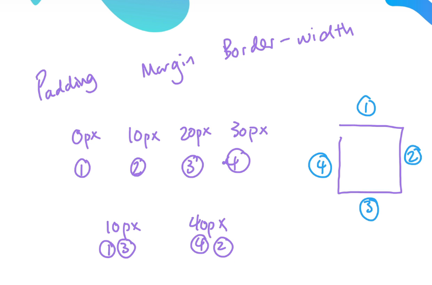
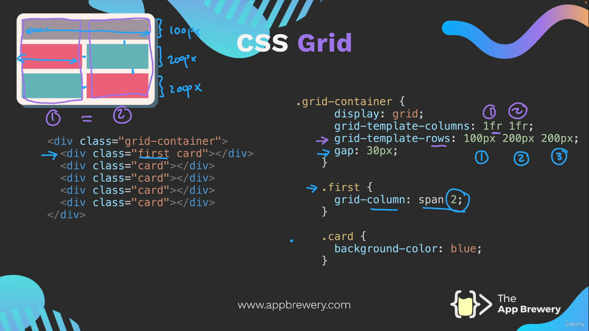
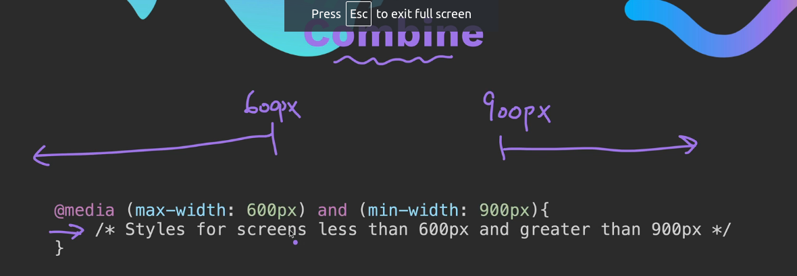
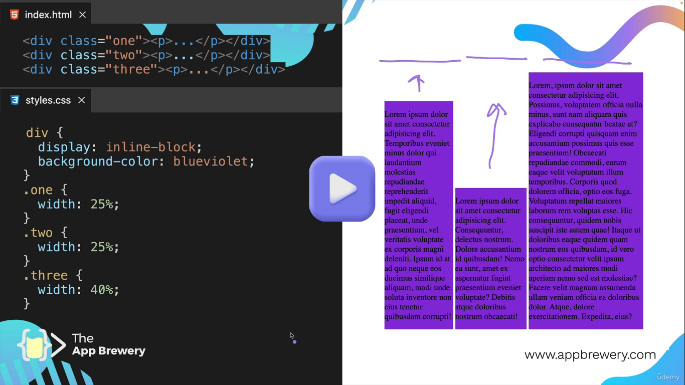
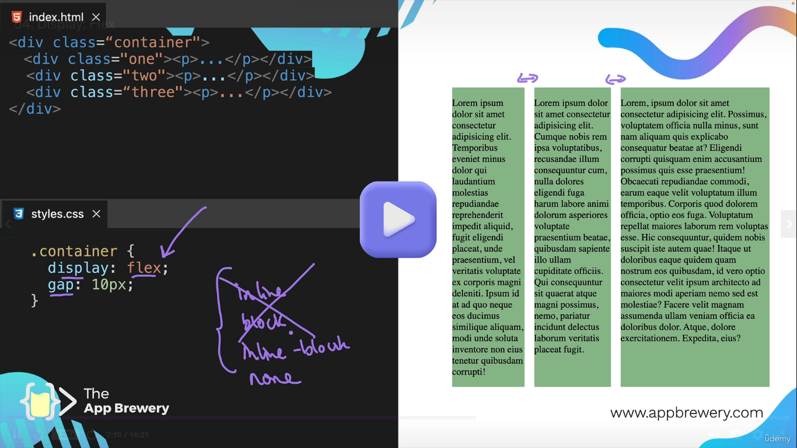
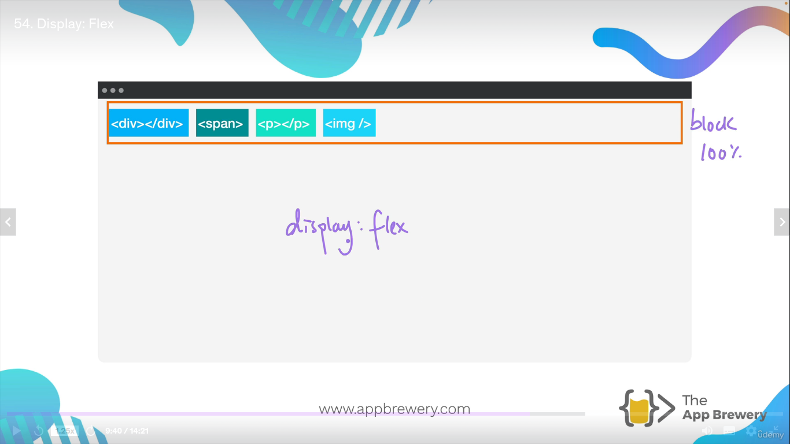
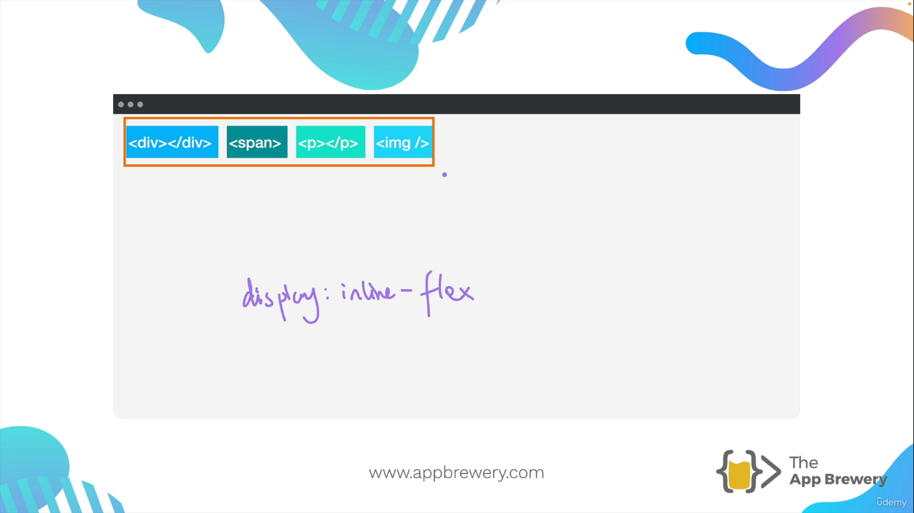

# Basics of Web bootcamp
## CSS -

### Level 1
- class selectors
- Id selectors
- Element selectors
- Attribute selectors

- background-color
- color
- height
- width

### Level 2
Font Properties
- font-weight
- font-size
- font-family
- text-align

> 1 px ---> 1/96^th^ inch ----> 0.26 mm  
> 1 pt ---> 1/72^th^ inch ----> 0.35 mm  
> 1 em ---> 100% of parent tag  
> 1 rem ---> 100% of root (root means <html> tag)

```html
<body><!-- 20px   -->
  <h1>Hello</h1> <!--  1em = 20px  or 2em = 40px  -->
</body>
```
```html
<html> <!--  20px  -->
  <body>
    <footer>
      <h2>Hello</h2> <!--  1rem  = 20px  or 2rem = 40px  -->
    </footer>
  </body>
</html>
```

### Level 3
- [Margin](#margin)
- [Padding](#padding)
- [Border](#border)
- [pesticide](#pesticide-extension)(chrome extension)



#### Margin
```css
{
  margin: 0px 10px 20px 30px;

  /* TOP RIGHT BOTTOM LEFT (clock-wise) */

  margin: 10px 20px;
  /* top&bottom   right&left */

}

```

#### Padding
```css
{
  padding: 0px 10px 20px 30px;

  /* TOP RIGHT BOTTOM LEFT (clock-wise) */

  padding: 10px 20px;
  /* top&bottom   right&left */

}

```

#### Border

```css
p1{
border: 30px solid black;
}

{
  border-width: 0px 10px 20px 30px;

  /* TOP RIGHT BOTTOM LEFT (clock-wise) */

  border-width: 10px 20px;
  /* top&bottom   right&left */

}

```
#### Pesticide extension
After installing extension and open a website which is live website(running on a server) then press `ctrl` to see the hover bar at the bottom.
  
	
### CSS Cascade
	
cascade means (you can search in google)
but here we should know the importance of multiple rules applied on same element or tag, which rule is applied first.
First bowser see the **External CSS** then **Internal CSS** then **Inline CSS**
> External CSS ----> Internal CSS ----> Inline CSS
  
#### Important of CSS catogory precedence rule
1. Position
2. Specifity
3. Type
4. Importance
  
##### 1. Position
```css
li{
  color: red;
  color: blue;
  }
```
##### 2. Specifity
> **NOTE:** flows goes from TOP to BOTTOM. Element Selector --> Class Selector ---> Attribute Selector ---> Id Selector 
```html
<li id="first-class" class="first-class" draggable>
```
```css
li{     /* this one is least specific. Element Selector*/
  color: blue;
 }
.first-class{
  color: red;
 }
 li[draggable] {
  color: purple; 
 }
 #first-class{
  color: orange;
 }
```
##### 3. Type
```html
  <link rel="stylesheet" href="./style.css">
  <style></style>
  <h1 style=" ">Hello</h1>
```
  
##### 4. Importance
```css
  color: red;
  color: green !important;
```
#### Combining CSS 
```html
<p>Yellow text</p>
<div class="box inner-box">
	<p>White Text</p>
</div>

```
```css
p{
	color: Yellor;
}
.inner-box p{
	color: white;
}
```

##### 1. Group rule
	
 Group = Apply to both selectors
```css
selector, selector{
	color: bluevoilet;
}
```
##### 2. Child rule
	
It's only work only ONE child element tag, NOT for grand child.
Works on Only One level deep. 
```css
selector > selector{
	color: firebrick;
}
```
selector `>` selector means parent `>` child

##### 3. Descendant

Descendant = Apply to descendant of a left side
```css
selector1 selector2{
	color: blue;
}
```
selector1 is An Ancestor selector and selector2 is Descendant selector
- Example

```html
<div class="box">
    <p class="done">Do these things today!</p>
    <ul class="list">
      <li>Wash Clothes</li>
      <li class="done">Read</li>
      <li class="done">Maths Questions</li>
    </ul>
  </div>
```
```css
.box li{
    color: blue;
}
```
##### 4. Chaining
Chaining = Apply where ALL selectors are true

```css
selector1selector2{
	color: seagreen;
}
```


##### 5. Combining Combiners
```css
selector1 selector2selector3{
	font-size: 0.5rem;
}
```
- example - change the font-size of `p` element

```html
<div class="box">
    <p class="done">Do these things today!</p>
    <ul class="list">
      <li>Wash Clothes</li>
      <li class="done">Read</li>
      <li class="done">Maths Questions</li>
    </ul>
  </div>

  <ul>
    <p class="done">Other items</p>
  </ul>
``` 
```css

.box p.done{ /* WRONG*/
	font-size: 0.5rem;
}

ul p.done{    /*CORRECT*/
    font-size: 0.5rem;
}
```

#### CSS Positioning
1. [Static](#1.-static)
2. [Relative](2.-relative)
3. [Absolute](3.-absolute)
4. [Fixed]()

You can practice in this [LINK](https://appbrewery.github.io/css-positioning/)


##### 1. Static


##### 2. Relative


##### 3. Absolute


> NOTE: If `position: relative` is NOT found in Ancestors element then this descendant element will move to TOP-LEFT corner.

- z-index is change order of position in css in z-axis
```css
 z-index: 0; /*default value*/
 z-index: -1; /*change the order from Top to Bottom*/
```

##### 4. Fixed


## Advanced CSS

1. Block
2. Inline
3. Inline-Block


### CSS Display

1. Media Queries
2. CSS Grid
3. CSS Flexbox
4. External Frameworks

#### Media Queries

```css
@media (max-width: 600px){
    /* CSS  for screens below or equal to 
    600px  */
}
```
#### CSS Grid



#### CSS Flexbox


#### Bootstrap framework


> Bootstrap is built on Flexbox 

	
## Media query

```css
@media (max-width: 600px){
    h1{
        font-size: 15px;
    }
}
```


```css
@media (mix-width: 600px) and (max-width: 900px){
    /* Styles for screen between 600 and 900px */
}
```



> Code practice

```css
@media (min-width:1601px){
      body{
        background-color: seagreen;
      }
    }
    @media (min-width:1201px) and (max-width:1600px){
      body{
        background-color: limegreen;
      }
    }
    @media (min-width:481px) and (max-width:1200px){
      body{
        background-color: powderblue;
      }
    }
    @media (min-width:319px) and (max-width:480px){
      body{
        background-color: lightsalmon;
      }
    }
```

## Flexbox

we have tables to show data in row and column but it is specifically tabular data.

```html
<table>
    <tr class="row">
      <td class="col1">Lorem ipsum dolor sit amet consectetur</td>
      <td class="col2">Lorem ipsum dolor</td>
      <td class="col3">Lorem ipsum dolor sit amet consecteturit amet consectetur</td>
    </tr>
  </table>
```
```css
.col1{
  width: 25%;
}
.col2{
  width: 25%;
}
.col3{
  width: 40%;
}
```


> And as you'll see, there are much, much better tools to do this nowadays.

>So you're not left in the dark.

>After people stopped using tables for layout, they started using what we've explored previously, which is using the display property.



> But this also a lengthy and pain full process to fix this


> This is not a responsive modern website tool.  we have **Flexbox**


#### How to USE Flex

Just write `div` with `container` **class**  
and write css `display: flex;`
```html
 <div class="container">
    <div class="one"><p>...</p></div>
    <div class="two"><p>...</p></div>
    <div class="three"><p>...</p></div>
  </div>
```

```css
.container{
  display: flex;
  gap: 10px;
}
```








> There are two different version of flexbox to use as per your requirements

