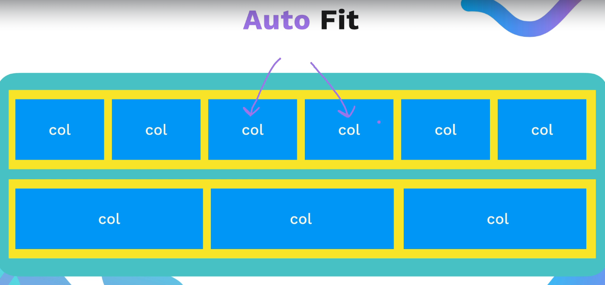
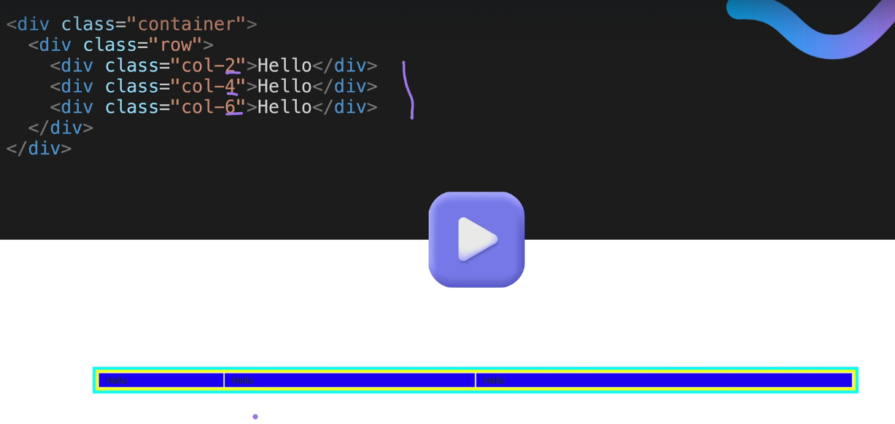
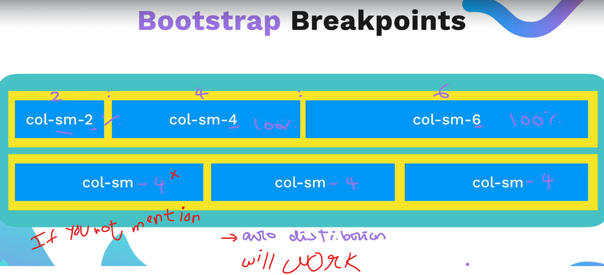
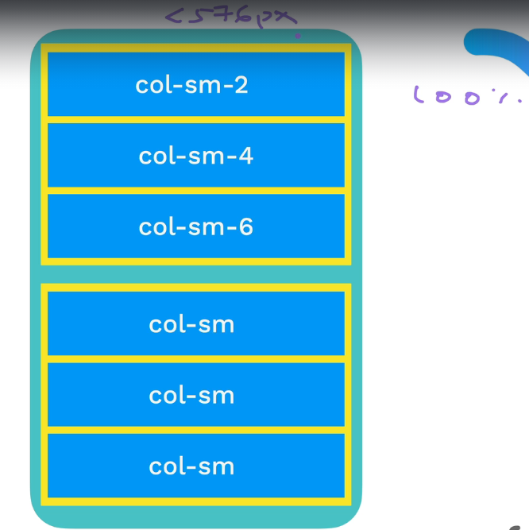
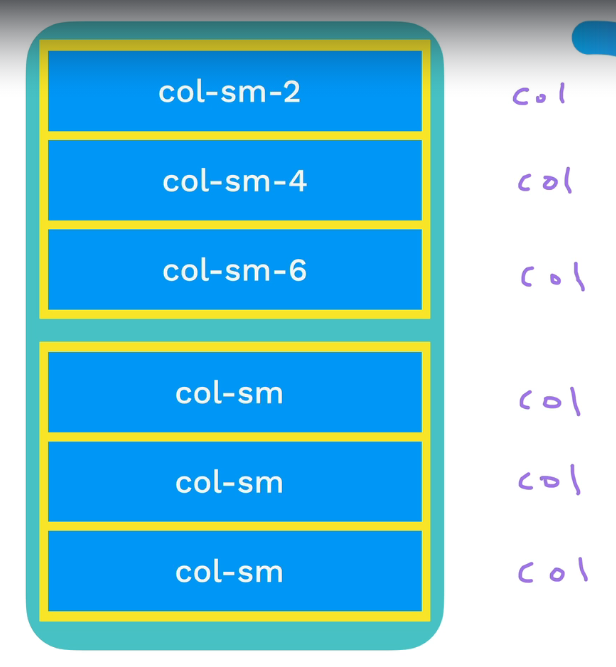
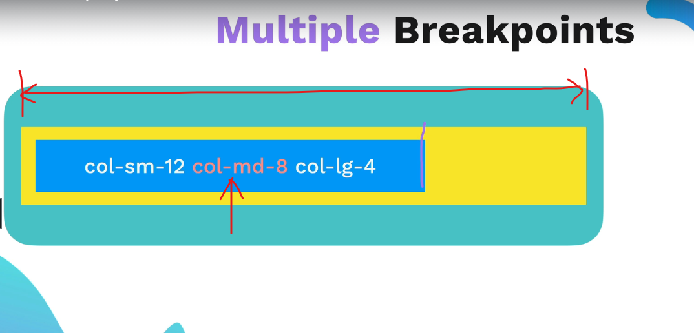
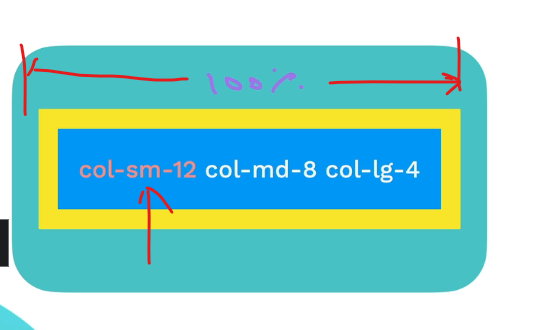
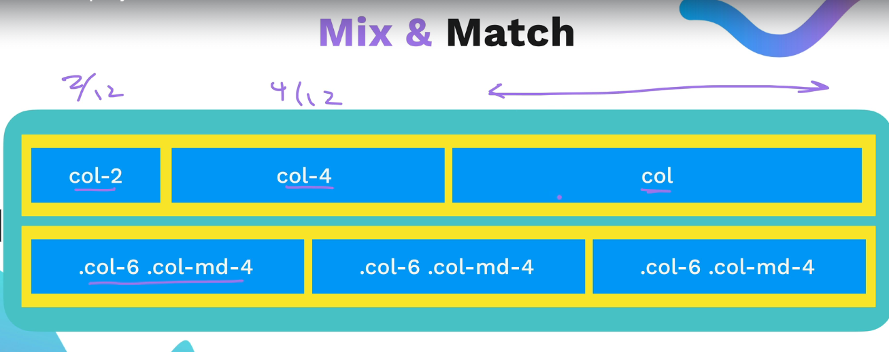

# Bootstrap

Bootstrap is a CSS Framework developed by _Two Twitter Developer in 2010_

**_Mark Auto & Jacob Donton_**

## When to use Bootstrap

- If you want create quick website with responsicve Both Desktop and Mobile screen then use Bootstrap

- If you have complex design then it is NOT recommended to use Bootstrap

- If you want to use pixel size icons and cards quality and need some customization then it is NOT recommend to use Bootstrap, it's heavy customize the code using Bootstrap.

## How to use Bootstrap

1. Copy CDN `link` from Bootstrap website [https://getbootstrap.com/](https://getbootstrap.com/)
2. Paste into _html_ file in `link` tag

```html
<html lang="en">
  <head>
    <meta charset="utf-8" />
    <meta name="viewport" content="width=device-width, initial-scale=1" />
    <title>Bootstrap</title>
    <link
      href="https://cdn.jsdelivr.net/npm/bootstrap@5.3.0/dist/css/bootstrap.min.css"
      rel="stylesheet"
      integrity="sha384-9ndCyUaIbzAi2FUVXJi0CjmCapSmO7SnpJef0486qhLnuZ2cdeRhO02iuK6FUUVM"
      crossorigin="anonymous"
    />
  </head>

  <body></body>
</html>
```

There are so many CSS Frameworks

- Tailwind
- Bootstrap
- and many more

You can search which css framework is most usage and popular

### Bootstrap Exercise

Below code is an Exercise, and Bootstrap code to achieve as Goal shown.

```html
<!DOCTYPE html>
<html lang="en">
  <head>
    <meta charset="utf-8" />
    <meta name="viewport" content="width=device-width, initial-scale=1" />
    <title>Bootstrap</title>
    <!-- TODO 1: Add the Bootstrap link here. -->
    <style>
      /* TODO 4: Use flexbox to center the card in the vertical and horizontal center. */
    </style>
  </head>

  <body>
    <div class="flex-container">
      <!-- TODO 2: Add the Bootstrap Prebuilt Card here -->
      <!-- TODO 3: Change the image src to display the flower.jpg image. -->
    </div>
  </body>
</html>
```

#### SOLUTION

```html
<!DOCTYPE html>
<html lang="en">
  <head>
    <meta charset="utf-8" />
    <meta name="viewport" content="width=device-width, initial-scale=1" />
    <title>Bootstrap</title>
    <!-- TODO 1: Add the Bootstrap link here. -->
    <link
      href="https://cdn.jsdelivr.net/npm/bootstrap@5.3.0/dist/css/bootstrap.min.css"
      rel="stylesheet"
      integrity="sha384-9ndCyUaIbzAi2FUVXJi0CjmCapSmO7SnpJef0486qhLnuZ2cdeRhO02iuK6FUUVM"
      crossorigin="anonymous"
    />
    <!-- <link rel="stylesheet" href="style.css"> -->

    <!-- we can use STYLESHEET but it should be BELOW the CDN link -->

    <style>
      /* TODO 4: Use flexbox to center the card in the vertical and horizontal center. */
      .flex-container {
        display: flex;
        justify-content: center;
        align-items: center;
        height: 100vh;
      }
    </style>
  </head>

  <body>
    <div class="flex-container">
      <!-- TODO 2: Add the Bootstrap Prebuilt Card here -->
      <div class="card" style="width: 18rem">
        
        <div class="card-body">
          <h5 class="card-title">Card title</h5>
          <p class="card-text">
            Some quick example text to build on the card title and make up the
            bulk of the card's content.
          </p>
          <a href="#" class="btn btn-primary">Go somewhere</a>
        </div>
      </div>
      <!-- TODO 3: Change the image src to display the flower.jpg image. -->
    </div>
  </body>
</html>
```

## Bootstrap 12 Column Layout system

12 column containes `3` components

```html
<div class="container">
  <div class="row">
    <div class="col">Hello</div>
    <div class="col">Hello</div>
    <div class="col">Hello</div>
    <div class="col">Hello</div>
    <div class="col">Hello</div>
    <div class="col">Hello</div>
    <div class="col">Hello</div>
    <div class="col">Hello</div>
    <!-- ...   upto 12 column -->
  </div>
</div>
```




### Boostrap container


> NOTE: Those values is refering to the `viewport` width means size of screen.

### Size column


Instead of writing class of name containers. We can write `col` names like `col-2 col-4 col-6 ....` to adjust width of column based on number



### Bootstrap Breakpoints


Breakpoints - google it :stuck_out_tongue_winking_eye:

> NOTE: when we are using Breakpoints, we don't really need `@media()` queries.

If we are using `col-sm-2` means the Dimensions are lie between `>=576px  and <=768px`.





> Note here, if size is `<=576px` then column size is `100%`, means default value is `col` i.e, `100% width of viewport`



#### Multiple Breakpoints







#### Exercise

[https://yuangela.com/bootstrap-layout/](https://yuangela.com/bootstrap-layout/)

Exercise 1 : Solution

```html
<!-- My code -->
<div class="row">
  <div class="col-xl">50% desktop, 100% mobile</div>
  <div class="col-xl">50% desktop, 100% mobile</div>
</div>

<!-- Angela code -->
<div class="row">
  <div class="col-xl-6">50% desktop, 100% mobile</div>
  <div class="col-xl-6">50% desktop, 100% mobile</div>
</div>
```

Exercise 2 : Solution

```html
<!-- My code -->
<div class="row">
  <div class="col-lg-6">Column 1</div>
  <div class="col-sm">Column 2</div>
  <div class="col-sm">Column 3</div>
</div>

<!-- Angela code -->
<div class="row">
  <div class="col-lg-6 col-sm-12 col-10">Column 1</div>
  <div class="col-lg-3 col-sm-6 col-10">Column 2</div>
  <div class="col-lg-3 col-sm-6 col-10">Column 3</div>
</div>
```

Exercise 3 : Solution

```html
<!-- My code -->
<div class="row">
  <div class="col-xl-2 col-lg-4 col-md-6">Column 1</div>
  <div class="col-xl col-lg col-md">Column 2</div>
</div>

<!-- Angela code -->
<div class="row">
  <div class="col-xxl-1 col-xl-2 col-lg-4 col-md-6">Column 1</div>
  <div class="col-xxl-11 col-xl-10 col-lg-8 col-md-6">Column 2</div>
</div>
```

### Bootstrap Components

1. Apply `SUCCESS` button in html anywhere using only bootstrap. [Click Here for Docs button](https://getbootstrap.com/docs/5.3/components/buttons/)

```html
<!DOCTYPE html>
<html lang="en">
  <head>
    <meta charset="UTF-8" />
    <meta name="viewport" content="width=device-width, initial-scale=1.0" />
    <title>Bootstrap Components</title>
    <link
      href="https://cdn.jsdelivr.net/npm/bootstrap@5.3.0-alpha2/dist/css/bootstrap.min.css"
      rel="stylesheet"
      integrity="sha384-aFq/bzH65dt+w6FI2ooMVUpc+21e0SRygnTpmBvdBgSdnuTN7QbdgL+OapgHtvPp"
      crossorigin="anonymous"
    />
    <style></style>
  </head>

  <body></body>
</html>
```

SOLUTION

```html
<!DOCTYPE html>
<html lang="en">
  <head>
    <meta charset="UTF-8" />
    <meta name="viewport" content="width=device-width, initial-scale=1.0" />
    <title>Bootstrap Components</title>
    <link
      href="https://cdn.jsdelivr.net/npm/bootstrap@5.3.0-alpha2/dist/css/bootstrap.min.css"
      rel="stylesheet"
      integrity="sha384-aFq/bzH65dt+w6FI2ooMVUpc+21e0SRygnTpmBvdBgSdnuTN7QbdgL+OapgHtvPp"
      crossorigin="anonymous"
    />
    <style></style>
  </head>

  <body>
    <button type="button" class="btn btn-success">Success</button>
  </body>
</html>
```
